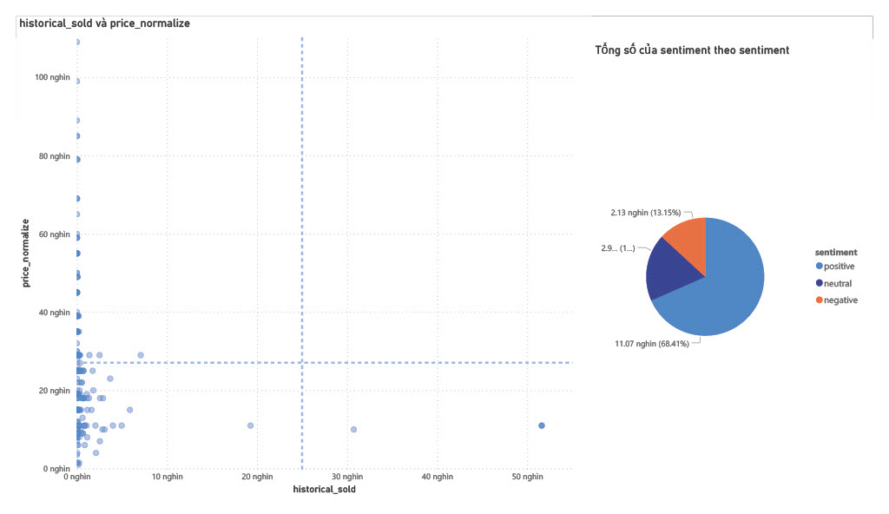

# Shopee Crawler + Phân tích các sản phẩm của người bán và sắc thái đánh giá

## Mục tiêu 
Mục tiêu của repo này bao gồm  
1. Thu thập dữ liệu từ sàn thương mại điện tử Shopee 
2. Xử lí dữ liệu
3. phân tích sản phẩm trên Shopee 
4. phân tích sắc thái đánh giá sản phẩm trên Shopee bằng PhoBert 

## Tiền xử lý dữ liệu

Đối với dữ liệu đánh giá sản phẩm thô, ta sẽ lần lượt làm sạch, chuẩn hoá và gán nhãn. Sau khi xoá bỏ dữ liệu trùng lắp, các dữ liệu hữu ích và chứa thông tin chỉ bao gồm hơn 16000 mẫu dữ liệu

## ▍Cách sử dụng：

### 1. Sửa đổi cấu hình
<br> Sửa đổi thông số user_list trong main.py và đặt vào cửa hàng bạn muốn theo dõi (ví dụ: https://shopee.vn/rosi_accessories , thêm "rosi_accessories" vào danh sách)
```
user_list = [
    "rosi_accessories"
]
```

### 2. 2. Thiết lập Environment & Chạy Crawler
    
<br>Sử dụng gói cài đặt pip
```
$ pip3 install -r requirement.txt
$ python3 main.py
```

### 3. Result
```
⌲ Step 1: Total shop detail fetchedd:
⌲ Step 2: Total pdp detail fetched:
100%|█████████████████████████████████████████████████████████████████████████████████████████████████████████████████| 4/4 [00:02<00:00,  1.67it/s]
⌲ Step 3: Total pdp review fetched:
100%|███████████████████████████████████████████████████████████████████████████████████████████████████████████| 1025/1025 [06:27<00:00,  2.65it/s]

```


## ▍Code-base structure

```
.
├── README.md
├── img
│   └── powerbi.jpg
├── main.py
├── requirements.txt
└── view
    │
    ├── api_v4_get_product_detail.py
    ├── api_v4_get_product_review.py
    ├── api_v4_get_shop_detail.py
    ├── csv
    │   ├── pdp_comment_raw.csv
    │   ├── pdp_detail.csv
    │   ├── sentences.txt
    │   └── shop_detail.csv
    └── preproc_sentiment
        ├── predict.py
        └── split.py
        
```


